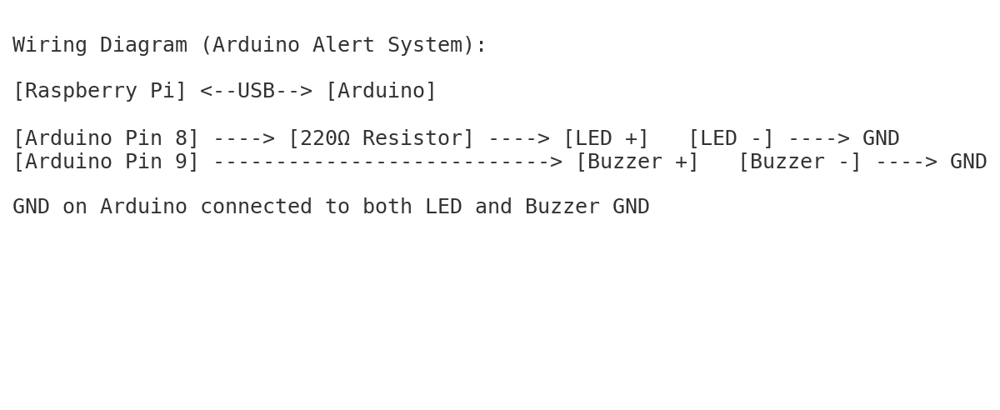

# Network Intrusion Detection System (NIDS) with Raspberry Pi + Arduino Alarm

This project uses a Raspberry Pi 3 A+ to monitor your local network for suspicious activity (like unknown devices).
When a threat is detected, it sends a signal to an Arduino over USB serial, which triggers an alert (LED and buzzer).

---

## Hardware

- Raspberry Pi 3 A+
- Arduino (Uno/Nano)
- LED (connected to pin 8, with 220Ω resistor)
- Buzzer (connected to pin 9)
- USB cable (Pi to Arduino)

---

## How It Works

- **Raspberry Pi** runs `monitor.py` to detect unauthorized devices using `arp -a`
- If a device not in the approved list is found, it sends an "ALERT" to the Arduino
- **Arduino** listens for the alert and triggers a visual + sound warning

---

## Project Structure

```
network-ids-raspberrypi-arduino/
├── pi/
│   └── monitor.py
├── arduino/
│   └── alert_system.ino
├── README.md
├── wiring_diagram.png
```

---

## Setup & Run

1. Edit the `authorized_ips` list in `pi/monitor.py`
2. Upload `arduino/alert_system.ino` to your Arduino via the Arduino IDE
3. Connect the Arduino to your Pi via USB
4. Run the monitor script on the Pi:
```bash
cd pi
python monitor.py
```

---

## Optional Improvements

- Add LCD display for alerts
- Log alerts to a file
- Detect port scans using `scapy` or `snort`

---

## Disclaimer

Use this project only on networks you own or have permission to test.

---

## Wiring Diagram


